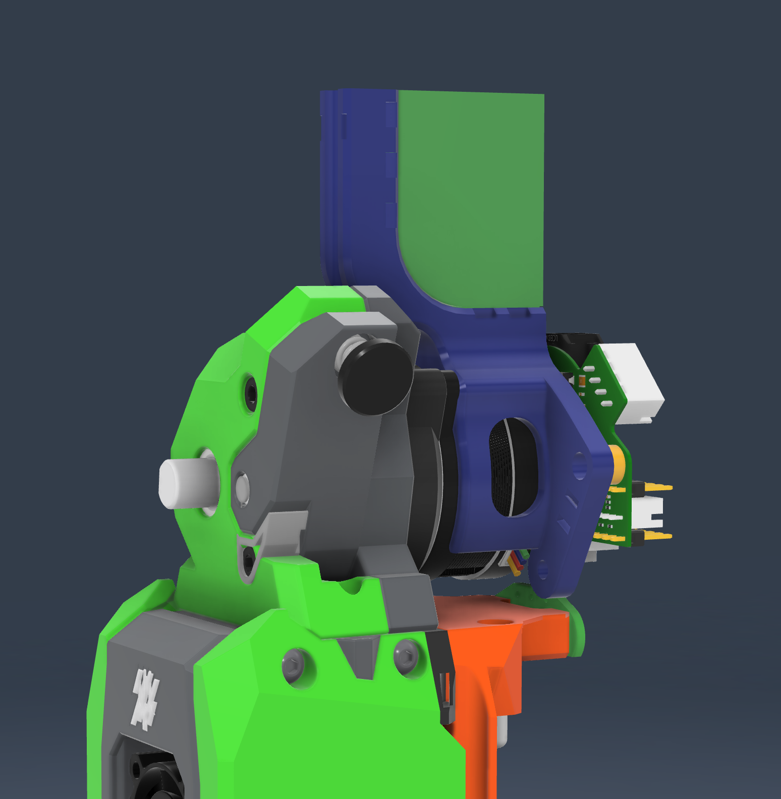

# EBB36 Mount for G2E Extruder

This mount is designed to securely attach an EBB36 control board to the G2E extruder assembly on an Anthead toolhead.

## Features
- Custom designed for EBB36 (And similar) board integration
- Compatible with G2E extruder assembly
- Clean and efficient mounting solution

## Printing Instructions
- Layer Height: 0.2mm
- Recommended orientation: pre-positioned
- No additional supports needed

## Installation
1. Print the mount using recommended settings
2. Remove the built in supports from the cable guide.
3. Install Voron spec heatpress inserts into both sides of the mount.
4. Secure the assembly to your G2E extruder, to do this you will need to use longer screws and sandwich the extruder & motor assembly.
5. Attach the EBB36 board to the mount

## License
This design is released under the creative commons license.

## Acknowledgments
- jairsoft on the StealthChanger Discord for the original idea for a Rhino mount.
- Original G2E extruder design
- Anthead toolhead community

## Questions or Issues?
Feel free to open an issue in this repository if you encounter any problems or have questions.

## Thank Me
A few ways you can show your appreciation for my work:\
[Buy Me a Coffee](https://buymeacoffee.com/makermylo) | [Subscribe on YouTube](https://www.youtube.com/@makermylo) | [Follow on X](https://x.com/MakerMylo)
